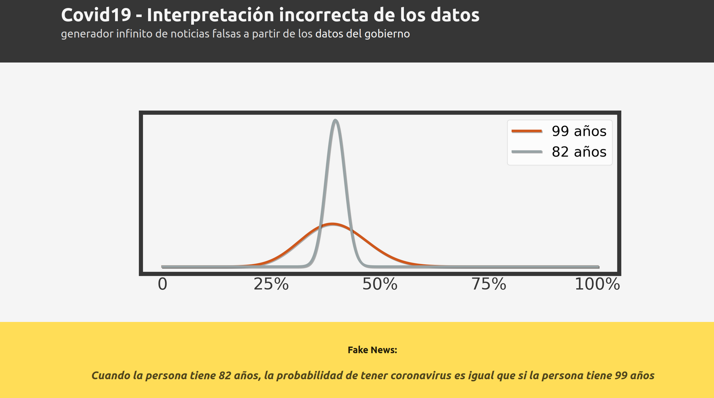

(es):es: 
Hola, bienvenidos al repositorio asociado a la página web ["covidarg-fake-news"](https://covidarg-fake-news.herokuapp.com/).

<b>Motivación</b>

* concientizar sobre las fake news

* recordar los cuidados generales

* difundir el analisis estadistico
 

<b>Explicación</b>

A partir de los [Datos Públicos](https://sisa.msal.gov.ar/sisa/) del Gobierno Argentino :v: :argentina: :gorilla: sobre Coronavirus se puede computar la probabilidad de tener la enfermedad para distintos grupos sociales usando un modelo matemático muy sencillo. 
 

 
 <b>Detalles:</b> <i>expandimos sobre los tres items</i>

 

* concientizar sobre las fake news

> Cuando los resultados son matemáticamente correctos, una alternativa a creer en la conclusión es cuestionar las hipótesis. Dada la (alta) velocidad con la que ocurren las interacciones virtuales es posible perder ésto de vista y construir razonamientos mal cimientados.   

* recordar los cuidados generales

> Argentina actualmente (Fines de Octubre 2020) tiene un máximo histórico en la cantidad de casos. Si bien la larga cuarentena generó entre otras cosas cansancio y aburrimiento es el tiempo presente (en un promedio geográfico) el momento en donde las precauciones individuales deben extremarse o en todo caso no relajarse.  

* difundir el analisis estadistico

> La expectativa general es que la "<i>transferencia tecnológica</i>" va a mejorar la calidad de vida de todos los ciudadanos; es en tal marco que se observa: la puesta en marcha de una base de datos pública es un excelente ejemplo de las acciones necesarias para llevar a la sociedad hacia ese "<i>futuro mejor</i>". 
 

   

 2. La lista de hipótesis:                                           |
    (2.A) - modelar positivo-negativo con Bernouilli                 |   
    (2.B) - modelar prior uniforme                                   |
    (2.C) - suponer que en la beta tenemos casos                     |
            "suficientemente simetricos" como para                   |
            decir Xmax=Xmean y usamos que:                           |
              Xmean = alpha / (alpha + beta)                         |
            (esto podria cambiarse en el codigo...)                  |

_____________________________________________________________________| 
DISCLAIMER Y FILOSOFIA: Es un 'juego' con forma de burla. O una burla|
con forma de juego. En ningún caso apunta a alentar la creación y/o  |
distribución de FAKE-NEWS en torno a algo grave como el Coronavirus. |
En Argentina, si creen que tienen síntomas deben llamar al 107.      |
Más info: https://www.argentina.gob.ar/salud/coronavirus-COVID-19    |
_____________________________________________________._______________|
